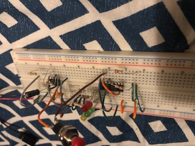
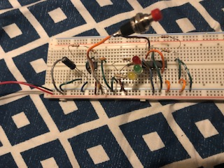

  
  

This was a project I did back in Highschool when I took an Electronics class. Now I don't remember too greatly of how it worked but I can show you some of the components and what they do. The best summary of what I can give is that when you push or hold down the red button, it would roulette the red,yellow, and green leds and when you let go, it would light up one of the colors. Firstly, we used a breadboard to build our projects on, it's the flat white board with holes in them. This is used to connect different components together. Now there are 2 chips in here that are quite important, a smaller one at the top and a bigger one at the bottom. Best I can recall is that is what is making it rotate the colors when the button is held down. There are weirdly shaped brown things with colored stripes that may've caught your eye, they are resistors. Self explanatory, they resist some of the electrical current. There is a brown circle and a black cylinder, those are capacitors, they store energy. Lastly are the cables, they're just used to connect the different components.