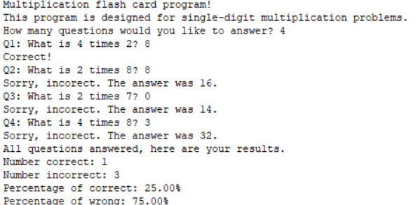

  
  

This program takes asks for a number representing the number of questions. It then creates 2 random integers and multiples them with eachother. It then prints out how many you got correct, and the accuracy of that data. This project was used to learn how the rand works in that language. It also introduced the format of function definitions and prototypes. 
