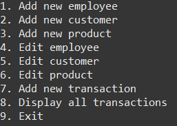

  
  

This small project was to work on editing arrays and printing them as if a Toy Store would work on inventory. It used functions that took in many parameters to line up exactly what would be needed to find the correct item. Once run, it would bring open a menu of 9 different options to add or edit employees, customers, or products. Aswell as add new transactions that were made and display all. This project was to help in making different classes and sending arguments to other classes. 
